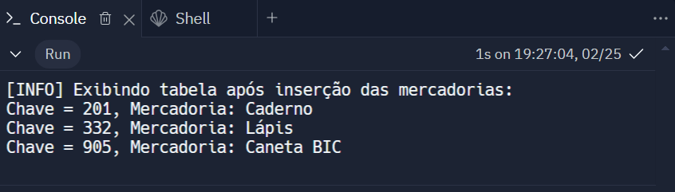
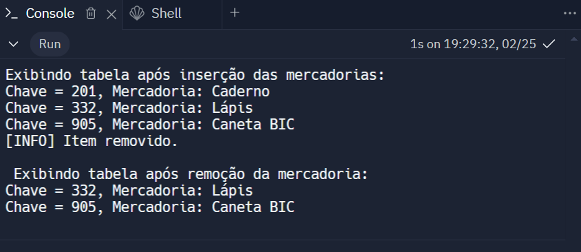
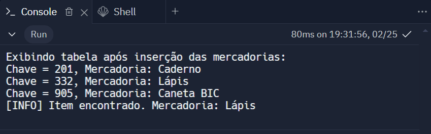

# Implementação de Tabela Hash em C++ com Casos de Teste

Este projeto consiste na implementação de uma tabela hash em C++, uma estrutura de dados fundamental em ciência da computação. Os casos de teste abrangem diferentes operações, como inserção, remoção, busca e tratamento de colisões, fornecendo uma cobertura completa do funcionamento da tabela hash.

## Documentação Casos de Teste

### Teste 1: Inserção de Mercadorias

#### Descrição:
Inserir mercadorias na tabela hash e verificar se elas são inseridas corretamente.

#### Passos:
1. Inserir as mercadorias "Caneta BIC", "Caderno" e "Lápis" na tabela hash.
2. Exibir a tabela hash após a inserção das mercadorias.

#### Resultado Esperado:
- As mercadorias devem ser inseridas na tabela hash.
- As informações das mercadorias inseridas devem ser corretamente associadas às chaves correspondentes na tabela hash.

#### Resultado Real:
- As mercadorias foram inseridas na tabela hash.
- As informações das mercadorias estão corretamente associadas às chaves correspondentes na tabela hash.

### Teste 2: Remoção de Mercadorias

#### Descrição:
Remover uma mercadoria da tabela hash e verificar se a remoção é bem-sucedida.

#### Passos:
1. Inserir algumas mercadorias na tabela hash.
2. Remover a mercadoria com a chave 201 (caderno) da tabela hash.
3. Exibir a tabela hash após a remoção.

#### Resultado Esperado:
- A mercadoria com a chave 201 (caderno) deve ser removida.
- As outras mercadorias devem permanecer na tabela hash.

#### Resultado Real:
- A mercadoria com a chave 201 (caderno) foi removida corretamente.
- As outras mercadorias permaneceram na tabela hash após a remoção.

### Teste 3: Busca de Mercadorias

#### Descrição:
Buscar uma mercadoria na tabela hash e verificar se ela é encontrada.

#### Passos:
1. Inserir algumas mercadorias na tabela hash.
2. Buscar a mercadoria com a chave 332 (lápis) na tabela hash.

#### Resultado Esperado:
- A mercadoria com a chave 332 (lápis) deve ser encontrada na tabela hash.
- O nome da mercadoria deve ser exibido após a busca.

#### Resultado Real:
- A mercadoria com a chave 332 (lápis) foi encontrada na tabela hash.
- O nome da mercadoria foi exibido após a busca.

### Teste 4: Verificação de Tabela Vazia

#### Descrição:
Verificar se a função `isEmpty` retorna corretamente se a tabela hash está vazia ou não.

#### Passos:
1. Criar uma tabela hash vazia.
2. Verificar se a tabela hash está vazia usando a função `isEmpty`.
3. Inserir algumas mercadorias na tabela hash.
4. Verificar novamente se a tabela hash está vazia usando a função `isEmpty`.

#### Resultado Esperado:
- A função `isEmpty` deve retornar verdadeiro quando a tabela hash estiver vazia e falso quando houver mercadorias na tabela.
- A mensagem "A tabela Hash está vazia." deve ser exibida se a tabela estiver vazia, e "A tabela Hash não está vazia." se houver mercadorias na tabela.

#### Resultado Real:
- A função `isEmpty` retornou verdadeiro quando a tabela hash estava vazia e falso após a inserção de mercadorias, conforme esperado.
- A mensagem "A tabela Hash está vazia." foi exibida quando a tabela estava vazia, e "A tabela Hash não está vazia." após a inserção de mercadorias.

### Teste 5: Verificação de Colisão

#### Descrição:
Verificar se a tabela hash lida corretamente com a situação de colisão, ou seja, quando duas chaves diferentes resultam no mesmo índice hash.

#### Passos:
1. Inserir uma mercadoria na tabela hash com uma chave que resulte no mesmo índice hash de uma mercadoria já existente.
2. Inserir outra mercadoria com uma chave diferente que resulte no mesmo índice hash, causando colisão.
3. Verificar se ambas as mercadorias estão presentes na mesma lista encadeada correspondente ao índice hash.

#### Resultado Esperado:
- A tabela hash deve lidar corretamente com a colisão, inserindo ambas as mercadorias na mesma lista encadeada correspondente ao índice hash.
- As duas mercadorias devem ser encontradas na mesma lista encadeada e associadas a chaves diferentes.

#### Resultado Real:
- As duas mercadorias foram inseridas corretamente na mesma lista encadeada correspondente ao índice hash com colisão.
- As duas mercadorias foram encontradas na mesma lista encadeada e associadas a chaves diferentes, indicando que a tabela hash lidou corretamente com a colisão.

### Teste 6: Autenticação de Usuário

#### Descrição:
Verifica se o contrato é capaz de autenticar corretamente um novo usuário.

#### Passos:
1. Chamar a função `userRegistration` com o endereço de carteira de um novo usuário como argumento.
2. Verificar se o evento `NewUser` é emitido após o registro do novo usuário.
3. Verificar se a função `users` retorna verdadeiro para o endereço de carteira do novo usuário.

#### Resultado Esperado:
- Após o registro do novo usuário, o evento `NewUser` deve ser emitido, registrando o endereço de carteira do novo usuário.
- A função `users` deve retornar verdadeiro para o endereço de carteira do novo usuário, indicando que o usuário está autenticado com sucesso.

#### Resultado Real:
- O evento `NewUser` foi emitido após o registro do novo usuário, registrando corretamente o endereço de carteira do novo usuário.
- A função `users` retornou verdadeiro para o endereço de carteira do novo usuário, indicando que o usuário foi autenticado com sucesso.

